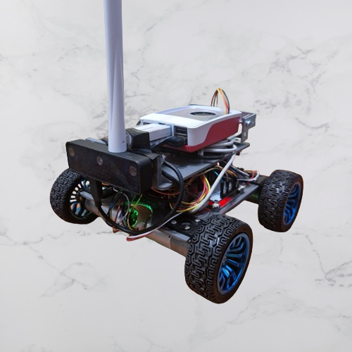

## ROS2 Autonomus rover

This autonomous rover is designed with differential kinematics and is equipped with a Raspberry Pi 5, ESP32 board, and an OAK-D Lite camera.

The software leverages ROS2 and micro-ROS, utilizing the Nav2 stack for autonomous navigation and control.

### Medium post releated to this repository:
- [How to Install ROS2 Humble on Raspberry Pi 5 and Enable Communication with ESP32 via micro-ROS Using Docker](https://medium.com/p/2d30dfcf211)
- [How to Install and Configure a USB Wi-Fi Adapter on Raspberry Pi 5 as an Access Point](https://medium.com/p/721f797468f6)
- [Integrating ORB-SLAM3 with ROS2 Humble on Raspberry Pi 5: A Step-by-Step Guide](https://medium.com/p/78e7b911c361)

  

### Demo

  
  

